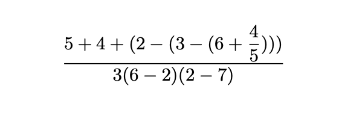

## Clojure Developer. Урок 1

Необходимо установить:
- JDK (https://sdkman.io/)
- Clojure CLI (https://clojure.org/guides/install_clojure)

Запуск REPL:

`clj` - запускает REPL в любом месте

`clj -X otus.hello-world/-main` - вызов функции внутри namespase

`clj -M src/otus/hello_world.clj` - запуск произвольного файла

### ДЗ
Запишите пример, указанный на картинке, в виде S-expression

- Откройте файл `src/otus/homework.clj`
- Запишите выражение внутри функции `solution`
- Ответ должен быть числом в формате `java.lang.Double` 
- Запустите тесты для проверки `clj -X:test`

